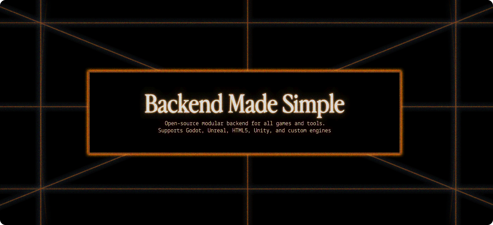

# Open Game Backend



- **Modular**: Mix, match, & modify modules as needed to fit your game's unique requirements.
- **Script like a game engine**: Easily extend & adapt on top of the [OpenGB Engine](/engine/introduction) using
  TypeScript. Designed to be scripted by game developers.
- **Batteries included**: Provides thoroughly reviewed, tested, and documented modules to get you started quickly &
  allow you to customize to fit your needs.
- **Secure, load-tested, & resilient**: Built to withstand the chaos that games need to grow & stay online. Load
  testing, rate limits, captchas, strict schemas, and more are all enforced by default.

## Prerequisites

- [Deno](https://docs.deno.com/runtime/manual/getting_started/installation)
- [Docker](https://docs.docker.com/get-docker/) ([#125](https://github.com/rivet-gg/opengb/issues/125))
- Git

## Install

**From GitHub (recommended)**

```sh
deno install -n opengb -fgA https://raw.githubusercontent.com/rivet-gg/opengb/v0.1.1/src/cli/main.ts
```

**From source**

After cloning the repo, run:

```
git clone https://github.com/rivet-gg/opengb.git
cd opengb
deno task cli:install
```

## Technologies Used

- **Language** TypeScript
- **Runtime** Deno
- **Database** Postgres
- **ORM** Prisma

## Documentation

- [Quickstart](http://opengb.dev/concepts/quickstart)
- [All available modules](http://opengb.dev/modules)
- [Building modules](https://opengb.dev/build/crash-course)
- [OpenGB Engine internals](http://opengb.dev/engine/introduction)
- Visit [opengb.dev](http://opengb.dev/introduction) for more

## Looking for the module registry?

See [rivet-gg/opengb-modules](https://github.com/rivet-gg/opengb-modules.git).

